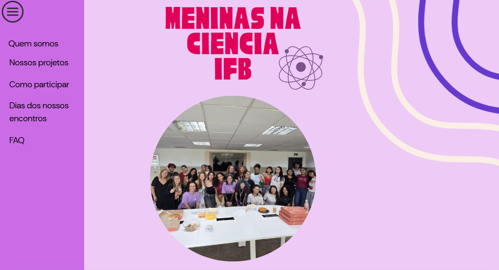
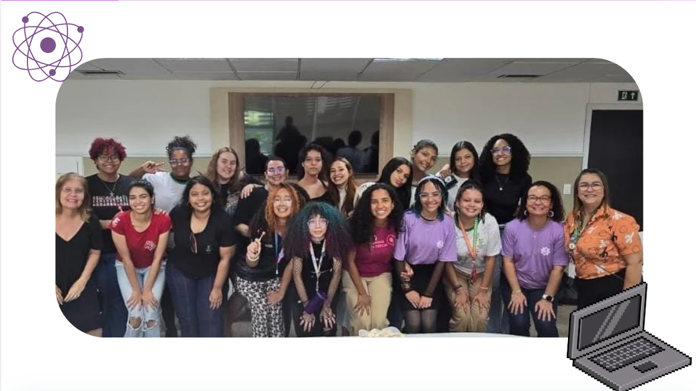
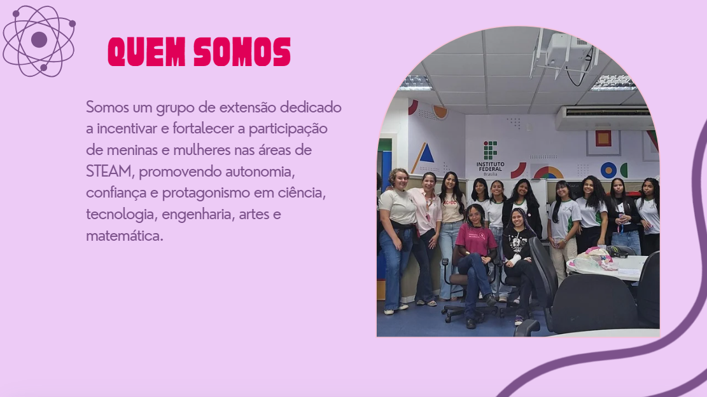
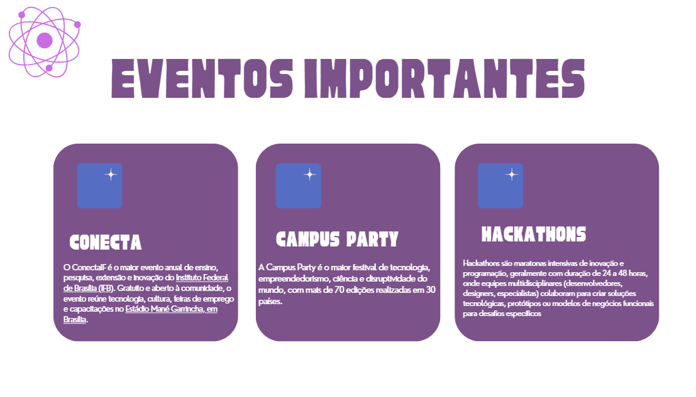
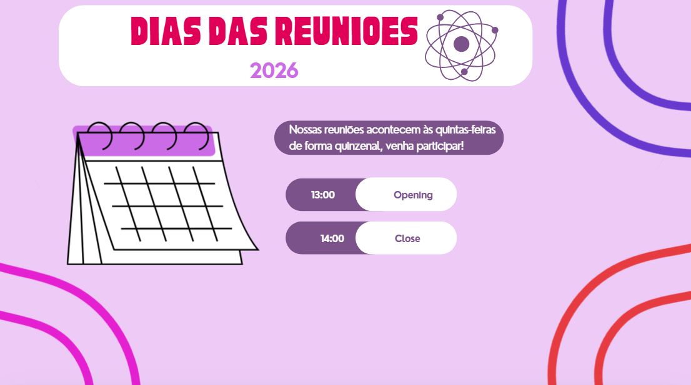
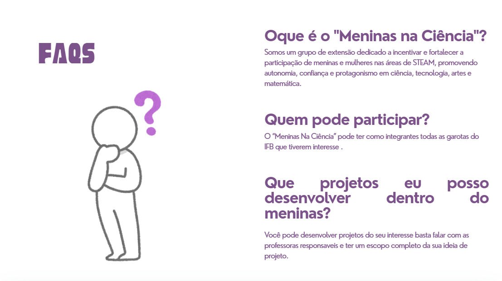
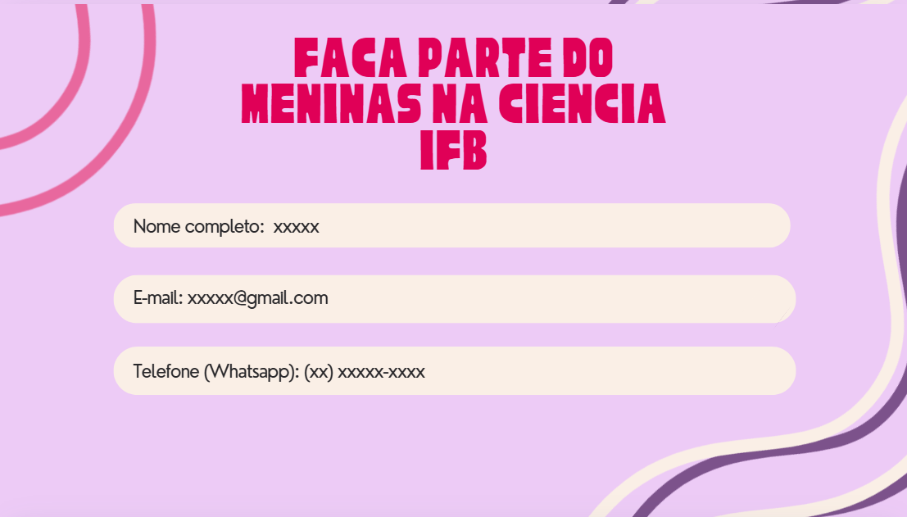

# site-do-projeto Meninas na Ciencia-IFB

O projeto de extensão Meninas na Ciência possui a intenção de incentivar a participação feminina nas áreas de STEAM (Ciência, Tecnologia, Engenharia, Arte e Matemática)e a landing page faz a apresentação das orientadoras, das alunas, os objetivos do projeto e trabalhos publicados. 

A imagem contém a primeira página com o menu e em seguida uma foto das integrantes, os objetivos do projeto e os eventos que comparecem constantemente.

      <td></td>
      <td></td>
      <td></td>
      <td></td>

Imagens do dia e horários das reuniões quinzenais, quem somos, como participar do projeto, contato e redes sociais.

      <td></td>
      <td></td>
      <td></td>
      <td></td>

